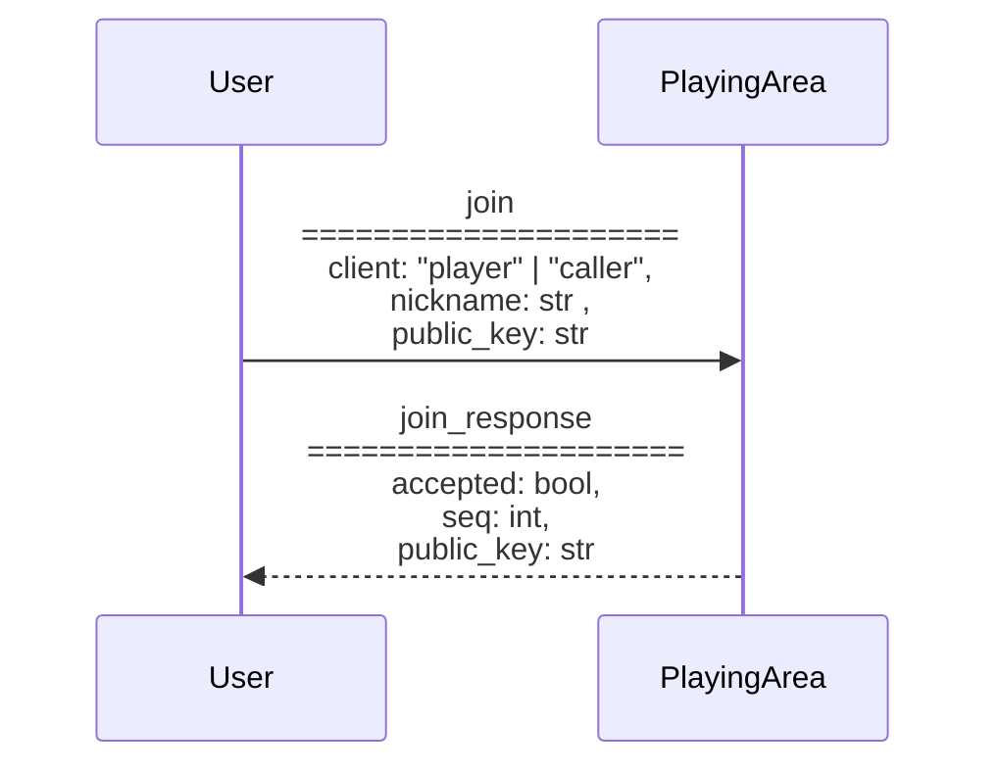

# Documentação
## Estrutura do projeto
```
.
├── src
│   ├── __init__.py
│   ├── BingoProtocol.py -------->
│   ├── Caller.py --------------->
│   ├── CitizenCard.py ---------->
│   ├── CryptoUtils.py ---------->
│   ├── Player.py --------------->
│   ├── PlayingArea.py ---------->
│   ├── run.sh ------------------>
│   └── User.py ----------------->
├── caller.py ------------------->
├── player.py ------------------->
├── playing_area.py ------------->
└── requirements.txt ------------>
```

## Comunicação entre os módulos


## Arranque
**User**: Player ou Caller



# Créditos
| Nº mec. | Nome |
|--|--|
| 102534 | Rafael Gonçalves |
| 102536 | Leonardo Almeida |
| 102778 | Pedro Rodrigues |
| 103740 | Anzhelika Tosheva |
