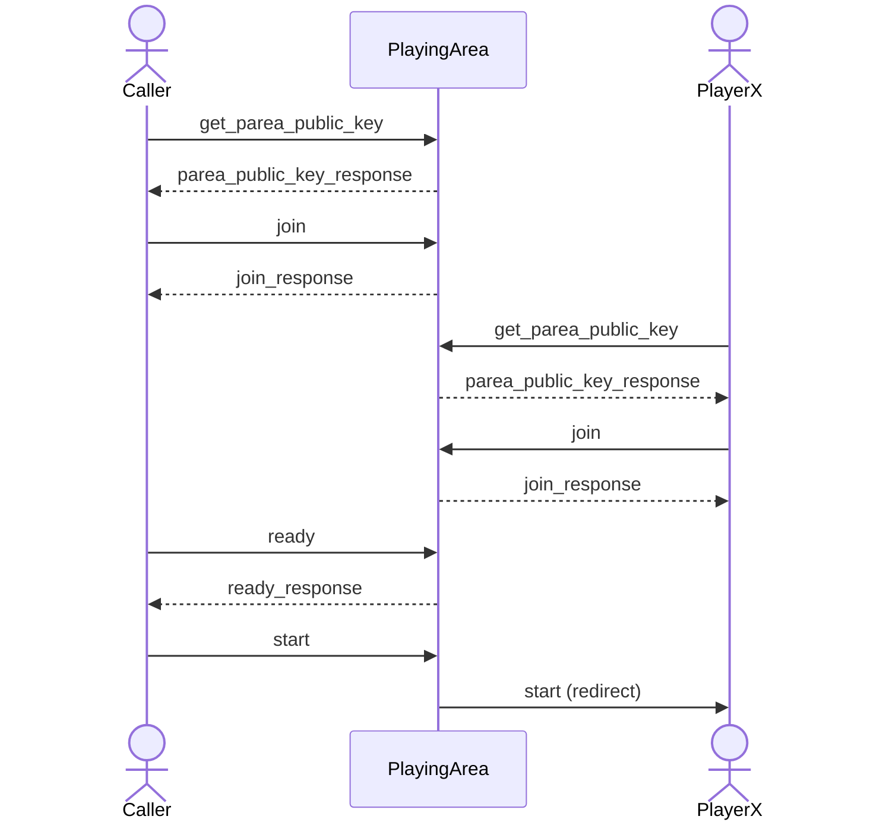
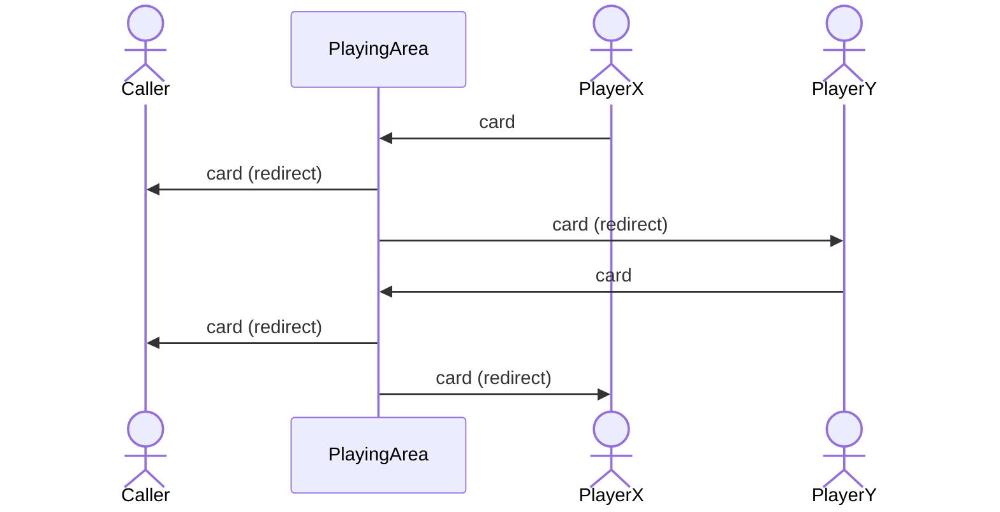
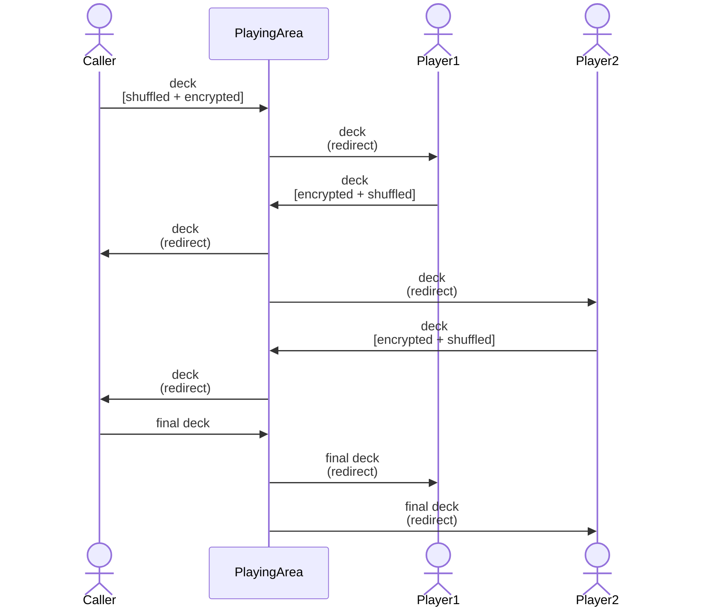
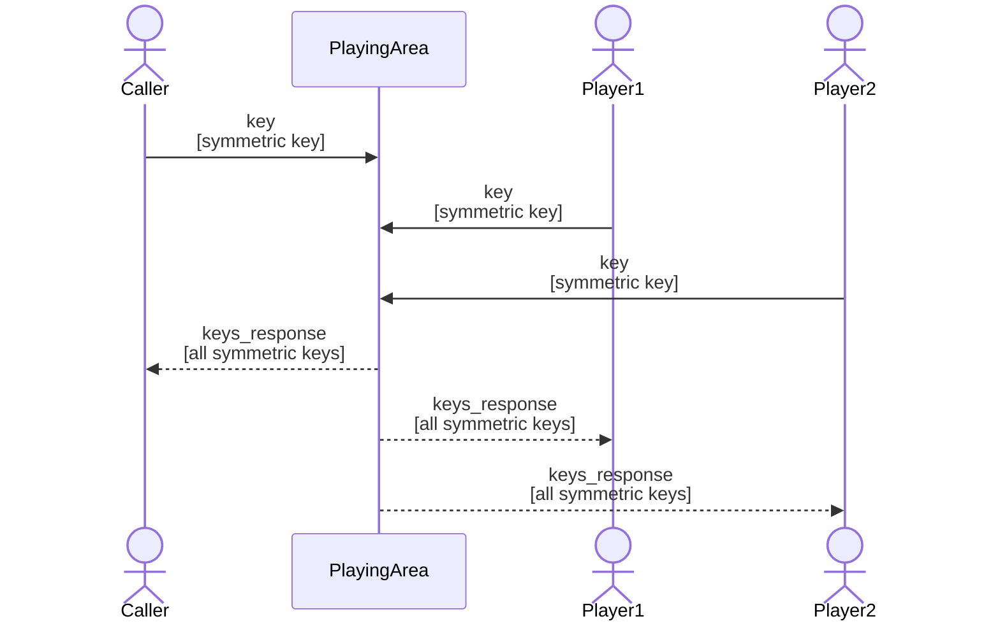
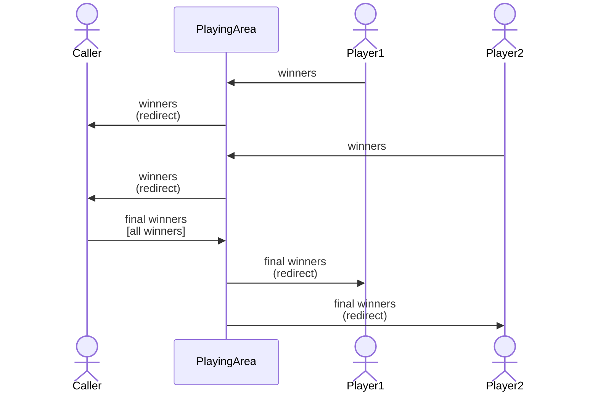
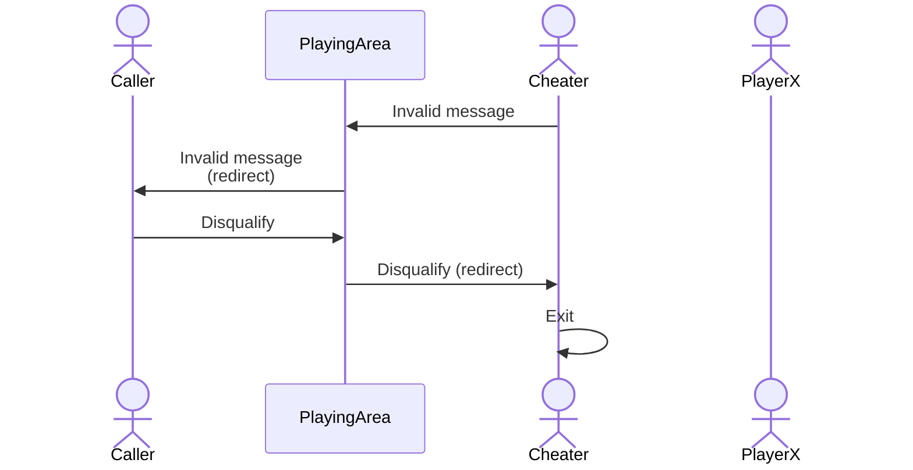
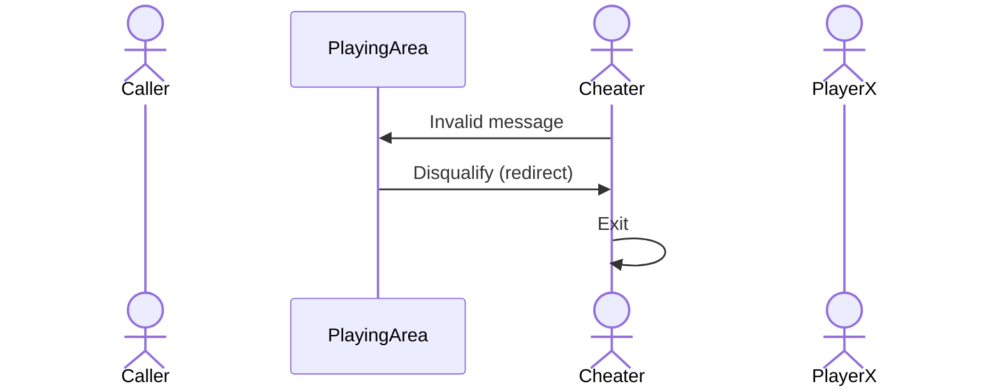

# Documentação

## Estrutura do projeto
```
.
├── src
│   ├── __init__.py
│   ├── BingoProtocol.py
│   ├── Caller.py
│   ├── CitizenCard.py
│   ├── CryptoUtils.py
│   ├── Player.py
│   ├── PlayingArea.py
│   ├── run.sh
│   └── User.py
├── caller.py
├── player.py
├── playing_area.py
└── requirements.txt
```

| File | Description |
|--|--|
| `BingoProtocol.py` | Implementação das mensagens utilizadas no protocolo, bem como a sua assinatura |
| `Caller.py` | Implementação da entidade *Caller* (extends *User*) |
| `CitizenCard.py` | Implementação da autenticação com cartão de cidadão/cartão virtual |
| `CryptoUtils.py` | Implementação classes responsáveis pela criptografia |
| `Player.py` | Implementação da entidade *Player* (extends *User*) |
| `PlayingArea.py` | Implementação da *Playing Area* |
| `run.sh` | Script para execução da *Playing Area*, *Caller* e 3 *Players* |
| `User.py` | Implementação da classe base *User* |
| `caller.py` | *Parse* de argumentos e criação de um *Caller* |
| `player.py` | *Parse* de argumentos e criação de um  *Player* |
| `playing_area.py` | *Parse* de argumentos e criação da *Playing Area* |
| `requirements.txt` | Módulos Python necessários à execução do projeto |


<br>

## Comunicação entre os módulos
A comunicação entre os diferentes módulos desenvolvidos é feita através de sockets TCP/IP.

<div style="page-break-after: always;"></div>

## 1. Novo jogo


<br>

1. Enquanto um utilizador não recebe a confirmação de registo da *PlayingArea*, a sua chave pública não deve ser conhecida, pelo que este dado deve estar encriptado na mensagem de registo (*join*). Para esse efeito, o *Caller* e os *Players* começam por enviar uma mensagem do tipo *get_parea_public_key* para a *Playing Area*. Esta responde com uma *parea_public_key_response*, que inclui a sua chave pública. Deste modo, os utilizadores conseguem encriptar informações sensíveis no *join*, garantido confidencialidade, uma vez que só a PlayingArea possui a chave privada para desencriptar.

2. As mensagens de registo (*join*) são assinadas digitalmente pelo utilizador, com a chave pública do `CITIZEN AUTHENTICATION CERTIFICATE`. A *PlayingArea* verifica a assinatura e a nacionalidade portuguesa, respondendo posteriormente com um *join response*.

3. Por intermédio de um input do utilizador, o *Caller* envia uma mensagem do tipo *ready* para a *Playing Area*, onde passa o seu *seq*. 

4. A *Playing Area* devolve no *ready_response* uma lista com as informações dos *players* que se conectaram (`seq, nickname, public_key`).

4. A mensagem *start* sinaliza o início do jogo e é redirecionada pela *PlayingArea* para todos os *players*.

```python
- get_parea_public_key
    msg = {
        data: {
            "type": "get_parea_public_key"
        }
        signature: str                  # Codificada para Base64
    }

- parea_public_key_response
    msg = {
        data: {
            "type": "parea_public_key_response",
            "parea_public_key": str     # Formato PEM
        }
        signature: str                  # Codificada para Base64
    }

- join 
    msg = {
        data: {
            "type": "join",
            "client": "player" | "caller",
            "nickname": str,
            "public_key": str,          # Formato PEM
            "cc_public_key": str        # Formato PEM
        },
        signature: str,                 # Codificada para Base64
        cc_signature: str               # Codificada para Base64
    }

- join_response
    msg = {
        data: { 
            "type": "join_response",
            "accepted": bool,
            "seq": int,
            "parea_public_key": str     # Formato PEM
        }
        signature: str                  # Codificada para Base64
    }

- ready
    msg = {
        data: {
            "type": "ready",
            "seq": int
        }
        signature: str                  # Codificada para Base64
    }

- ready_response
    msg = {
        data: {
            "type": "ready_response",
            "players": list
            # [[seq1, nick1, pub_key1], [seq2, nick2, pub_key2], ...]
        }
        signature: str
    }

- start
    msg = {
        data: {
            "type": "start",
            "seq": int,
            "players": dict
        # {seq1: [nick1, pub_key1], seq2: [nick2, pub_key2], ...}
        }
        signature: str
    }

```

<div style="page-break-after: always;"></div>

## 2. Troca de *cards*


<br>

1. Cada *Player*, após receber a mensagem de confirmação do início do jogo, gera uma chave simétrica, um IV e ainda o card a ser utilizado no jogo. Por fim, envia uma mensagem do tipo *card* para a *Playing Area*, onde passa o seu *seq*, o card gerado e a assinatura do conteúdo.
2. A *Playing Area*, além de verificar a assinatura, redireciona a mensagem para o *Caller* e para os *Players* adversários, para que ulteriormente possa(m) ser calculado(s) o(s) winner(s).


```python
- card
    msg = {
        data: {
            "type": "card",
            "seq": int,
            "card": list        # [int, int, ...]
        }
        signature: str          # Codificada para Base64
    }

- redirect
    msg = {
        data: {
            "type": "redirect",
            "msg": {
                "data": JSON,
                "signature": str
                # do emissor da mensagem (codificada para Base64)
            }
        }
        signature: str
        # da PlayingArea (codificada para Base64)
    }
```


## 3. Geração e encriptação do *deck*


<br>


1. O *Caller*, após receber os cards de todos os *players*, gera um *deck* aleatório (já baralhado) e encripta cada um dos seus elementos com a chave simétrica. De seguida, envia uma mensagem do tipo *deck* para a *Playing Area*, onde passa o seu *seq* e o *deck* gerado.

2. A *Playing Area*, além de verificar a assinatura, redireciona a mensagem para o primeiro player registado e para o *Caller*.
   
3. Cada *Player* encripta o *deck* recebido, com a sua chave simétrica e no final dá *shuffle* do mesmo. No final, envia uma mensagem do tipo *deck* para a *Playing Area*, onde passa o seu *seq* e o *deck* processado. A mensagem é redirecionada para o próximo *Player* que efetuou o *join* e para o *Caller*.
   
4. O *Caller* também recebe os *decks* processados pelos *Players*, pelo que é responsável por enviar o último recebido (assinado), através de uma *final_deck*, para a *Playing Area*, que a redireciona para todos os *Players*.


```python
- deck | final_deck
    msg = {
        data: {
            "type": "deck" | "final_deck",
            "seq": int,
            "deck": list
            # [encrypted(int), encrypted(int), ...] -> tudo codificado para Base64 
        }
        signature: str  # Codificada para Base64
    }
```


## 4. Troca de chaves simétricas



<br>

1. Além da mensagem do tipo *final_deck*, o *Caller* envia também uma do tipo *key*, onde passa o seu *seq* e a chave simétrica utilizada na encriptação de cada elemento do *deck*.

2. À semelhança do *Caller*, os *Players* enviam uma mensagem do tipo *key* para a *Playing Area*, passando o seu *seq* e a sua chave simétrica.

3. Após a *Playing Area* receber as chaves simétricas de todos os utilizadores, envia-lhes uma mensagem do tipo *keys_response*. A ordem das chaves simétricas listadas é contrária à ordem de encriptação dos *decks*.

```python
- key
    msg = {
        data: {
            "type": "key",
            "seq": int,
            "key": list         # [sym_key, iv] -> ambos codificados para Base64 
        }
        signature: str
    }

- keys_response
    msg = {
        data: {
            "type": "keys_response",
            "keys": list
            # [[sym_key1, iv1], [sym_key2, iv2], ...] -> tudo codificado para Base64
        }
        signature: str          # Codificada para Base64
    }
```

<div style="page-break-after: always;"></div>

## 5. Determinação dos vencedores



<br>

1. Cada *Player* desencripta o seu *deck* e determina o(s) winner(s) do jogo, enviando uma mensagem *winners*, de seguida, para a *Playing Area*.

2. Aquando da receção dessas mensagens, a *Playing Area* procede à verificação da assinatura e redireciona a mensagem para o *Caller*.

3. O *Caller* compara os winners recebidos com os que ele próprio determinou. Caso sejam iguais, envia uma mensagem do tipo *final_winners* para a *Playing Area*, onde inclui o seu *seq* e a lista de vencedores final.

4. Por fim, após a verificação da assinatura, a *Playing Area* redireciona a mensagem para todos os *Players*, terminando assim uma ronda do jogo.


```python
- winners
    msg = {
        data: {
            "type": "winners",
            "seq": int,
            "winners": list     # [seq1, seq2, ...]
        }
        signature: str
    }

- final_winners
    msg = {
        data: {
            "type": "final_winners",
            "seq": int,
            "winners": list     # [seq1, seq2, ...]
        }
        signature: str          # Codificada para Base64
    }
```

<br>


## Assinatura das mensagens trocadas

- Tanto a *Playing Area*, como o *Caller* e todos os *Players* possuem um par de chaves privada/pública. A chave privada é utilizada para assinar todas as mensagens a serem enviadas e redirecionadas (no caso da *Playing Area*). A chave pública é utilizada pelas restantes entidades do jogo, no ato de verificação das mensagens recebidas.
- **Algoritmo**: RSA (Rivest-Shamir-Adleman)
- **Padding**: PSS (Probabilistic Signature Scheme)
- **Função de síntese**: SHA256 (Secure Hash Algorithm 256)
- Todas as mensagens trocadas são sujeitas a processos de verificação da assinatura do emissor e de deteção de *cheating*.


<br>

## *Cheaters*

Um dos requisitos do projeto consistia em induzir probabilisticamente uma batota, no lado do *Caller* ou de um *Player*. Posto isto, foi necessário o desenvolvimento de mecanismos de deteção de conteúdos inválidos, para que o seu emissor fosse banido do jogo.

### Lista de batotas

**(Player)**
- envio de um card inválido, por exemplo, com valores repetidos ou tamanho incorreto.
- envio de mais do que um *card*.
- envio de uma mensagem, onde o *seq* não não corresponde ao atribuído pela *Playing Area*.
- envio de uma mensagem, com uma assinatura inválida.
- envio dos *final winners* (operação apenas permitida pelo *Caller*).
- envio de *winners* incorretos.

**(Caller)**
- envio dos *final winners* incorretos.
- desqualificação de um *Player* que não cometeu *cheating*.

<br>

Perante uma batota de um *Player*, ocorre a seguinte sequência de eventos:



<br>

No caso de um *Player* enviar uma mensagem que não pertence à sua entidade, desrespeitando o protocolo, a desqualificação é da responsabilidade da própria *Playing Area*.



<div style="page-break-after: always;"></div>

```python
- disqualify
msg = {
    data: {
        "type": "disqualify",
        "target_seq": int,
        "reason": str
    }
    signature: str  # Codificada para Base64 
}
```

<br>

## Logs

>**Logs**: O ficheiro `playing_area.log` é escrito no formato solicitado pelos docentes, no enunciado do projeto. Porém, os *logs* apresentados no terminal, a partir do menu do utilizador, não incluem a assinatura da mensagem, pois esta excede o *buffer* do *stdin*.

<br>

# Créditos
| Nº mec. | Nome |
|--|--|
| 102534 | Rafael Gonçalves |
| 102536 | Leonardo Almeida |
| 102778 | Pedro Rodrigues |
| 103740 | Anzhelika Tosheva |
