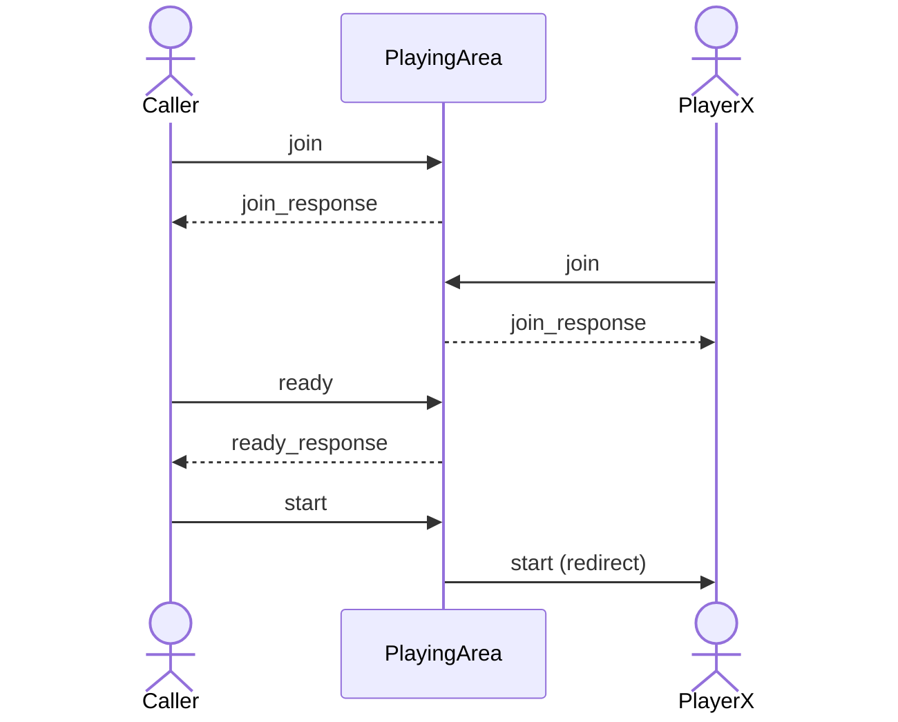
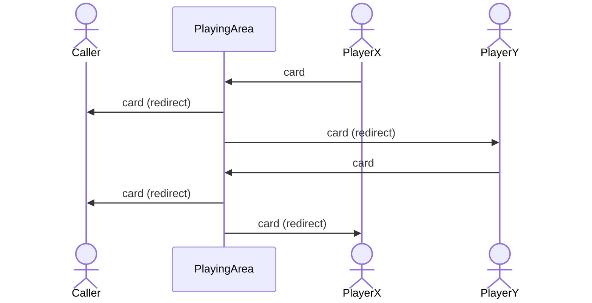
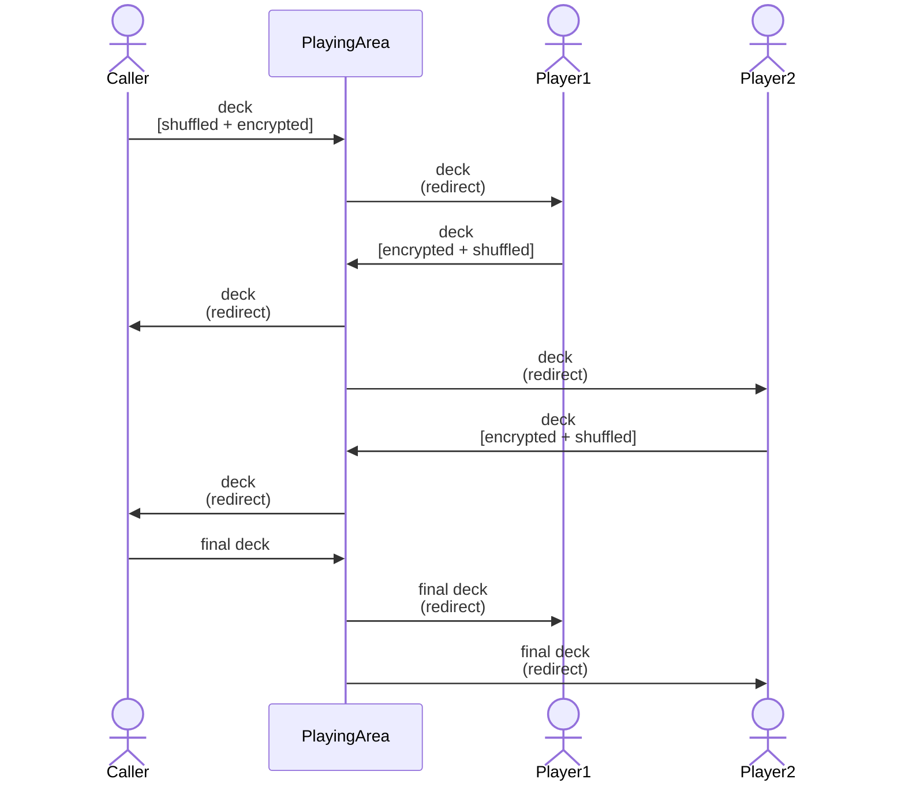
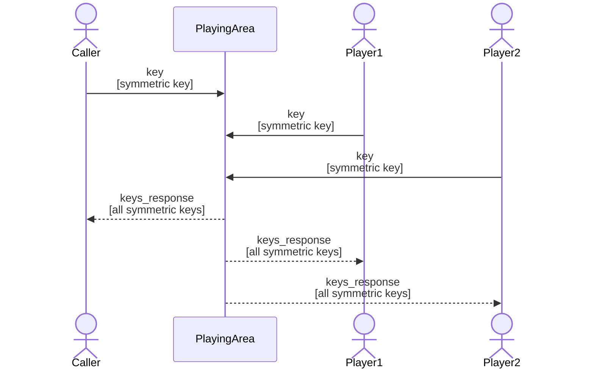
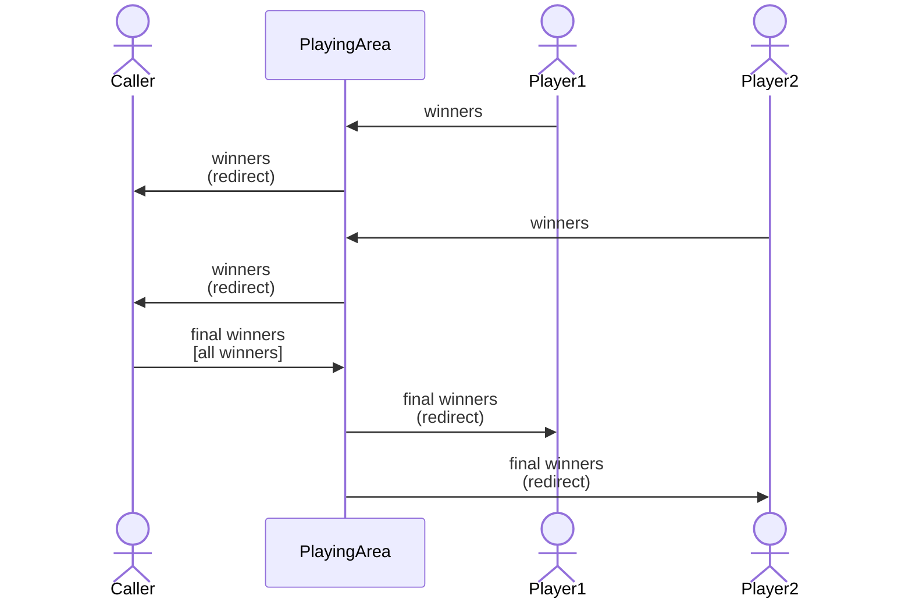
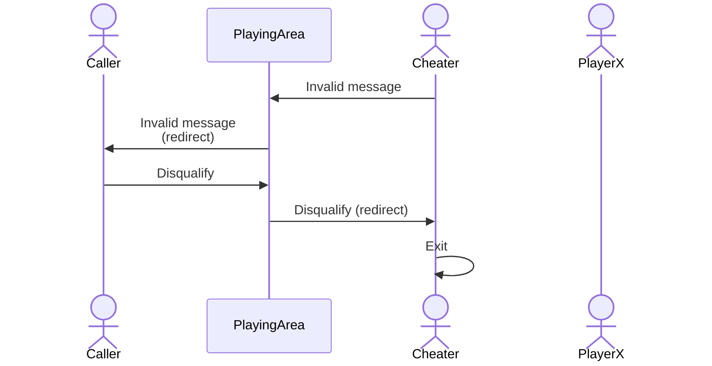
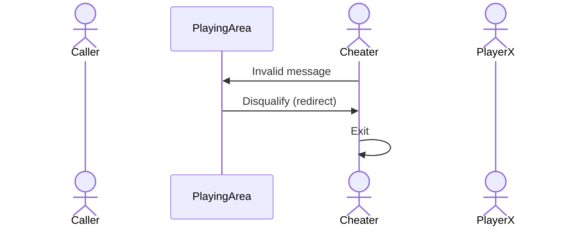

# Documentação

## Estrutura do projeto
```
.
├── src
│   ├── __init__.py
│   ├── BingoProtocol.py
│   ├── Caller.py
│   ├── CitizenCard.py
│   ├── CryptoUtils.py
│   ├── Player.py
│   ├── PlayingArea.py
│   ├── run.sh
│   └── User.py
├── caller.py
├── player.py
├── playing_area.py
└── requirements.txt
```

| File | Description |
|--|--|
| `BingoProtocol.py` | Implementação das mensagens utilizadas no protocolo, bem como a sua assinatura |
| `Caller.py` | Implementação da entidade *Caller* (extends *User*) |
| `CitizenCard.py` | Implementação da autenticação com cartão de cidadão/cartão virtual |
| `CryptoUtils.py` | Implementação classes responsáveis pela criptografia |
| `Player.py` | Implementação da entidade *Player* (extends *User*) |
| `PlayingArea.py` | Implementação da *Playing Area* |
| `run.sh` | Script para execução da *Playing Area*, *Caller* e 3 *Players* |
| `User.py` | Implementação da classe base *User* |
| `caller.py` | Source code para criação de um *Caller* |
| `player.py` | Source code para criação de um *Players* |
| `playing_area.py` | Source code para criação da *Playing Area* |
| `requirements.txt` | Requisitos python para execução do projeto |


## Requisitos cumpridos
TODO--------------------------------------------------------

<br>

## Comunicação entre os módulos
A comunicação entre os diferentes módulos desenvolvidos é feita através de sockets TCP/IP. Esta interação tem por base o envio e recessão de mensagens que seguem um protocolo bem definido.

As mensagens que constituiem o protocolo, bem como a assinatura dos seus conteúdos encontram-se no ficheiro `BingoProtocol.py`

<br>

## Protocolo desenvolvido
## 1. Novo jogo


<br>

1. O *Caller* e o *Player*, com o objetivo de se autenticarem, começam por enviar uma mensagem de join para a *Playing Area*. Nesta mensagem cada user envia o seu tipo (*caller* ou *player*), o seu nickname, a sua chave pública e a chave pública do cartão de cidadão ou cartão virtual. A *Playing Area* ao receber a mensagem, guarda as informações dos utilizadores e de seguida responde com uma mensagem de *join_response* onde indica a sua chave pública e o *sequence number* atribuído ao utilizador. Ainda é passado um campo *accepted* que indica se o processo de join foi bem sucedido ou não.

2. O *Caller* após receber a mensagem de *join_response*, por meio de input do utilizador, envia uma mensagem do tipo *ready* para a *Playing Area* onde passa o seu *seq*. A *Playing Area* ao receber a mensagem e após todos os testes de verificação, responde com uma mensagem de *ready_response*, onde passa uma lista com as informações dos *players* que se conectaram (`seq, nickname, public_key`).

3. O *Caller* ao receber a mensagem de *ready_response*, envia uma mensagem de *start* para a *Playing Area* de modo a sinalizar o inicío do jogo. Por sua vez, quando recebida, esta mensagem será redirecionada para todos os *players*.

```python
- join 
    msg = {
        data: {
            "type": "join",
            "client": "player" | "caller",
            "nickname": str,
            "public_key": str,          # Formato PEM
            "cc_public_key": str        # Formato PEM
        },
        signature: str,                 # Codificada para Base64
        cc_signature: str               # Codificada para Base64
    }

- join_response
    msg = {
        data: { 
            "type": "join_response",
            "accepted": bool,
            "seq": int,
            "parea_public_key": str     # Formato PEM
        }
        signature: str                  # Codificada para Base64
    }

- ready
    msg = {
        data: {
            "type": "ready",
            "seq": int
        }
        signature: str                  # Codificada para Base64
    }

- ready_response
    msg = {
        data: {
            "type": "ready_response",
            "players": list
            # [[seq1, nick1, pub_key1], [seq2, nick2, pub_key2], ...]
        }
        signature: str
    }

- start
    msg = {
        data: {
            "type": "start",
            "seq": int,
            "players": dict
        # {seq1: [nick1, pub_key1], seq2: [nick2, pub_key2], ...}
        }
        signature: str
    }

```

<br>

## 2. Troca de *cards*


<br>

1. Cada *Player* após receber a mensagem de confirmação do início do jogo, gera uma chave simétrica, um IV e ainda o card a ser utilizado no jogo. Por fim, o *Player* envia uma mensagem do tipo *card* para a *Playing Area* onde passa o seu *seq*, o card gerado e a assinatura do conteúdo.
2. A *Playing Area* ao receber a mensagem, verifica a assinatura e redireciona a mensagem para o *Caller* e para os *Players* adversários, de modo a que possam futuramente calcular o(s) winner(s).


```python
- card
    msg = {
        data: {
            "type": "card",
            "seq": int,
            "card": list        # [int, int, ...]
        }
        signature: str          # Codificada para Base64
    }

- redirect
    msg = {
        data: {
            "type": "redirect",
            "msg": {
                "data": JSON,
                "signature": str
                # assinatura do emissor da mensagem (codificada para Base64)
            }
        }
        signature: str
        # assinatura da PlayingArea (codificada para Base64)
    }
```

<br>

## 3. Geração e encriptação do *deck*


<br>


1. O *Caller* após receber os cards de todos os *players*, gera um *deck* aleatório (já suffled) e encripta cada um dos seus elementos com a chave simétrica gerada anteriormente. De seguida, envia uma mensagem do tipo *deck* para a *Playing Area* onde passa o seu *seq* e o *deck* gerado.

2. A *Playing Area* ao receber a mensagem, verifica a assinatura e redireciona a mensagem para o primeiro player que deu *join * e para o *Caller*.
   
3. Um *Player* ao receber a mensagem do tipo *deck*, após todas as validações, encripta o *deck* recebido com a sua chave simétrica e no final dá *shuffle* do mesmo. Para concluir, envia uma mensagem do tipo *deck* para a *Playing Area* onde passa o seu *seq* e o *deck* processado. Esta por sua vez, redireciona a mensagem para o próximo *Player* que deu *join* e para o *Caller*.
   
4. Visto que o *Caller* também recebe os *decks* processados pelos *Players*, quando os receber todos, este envia o último recebido assinado através da mensagem do tipo *final_deck* para a *Playing Area*.

5. A *Playing Area* ao receber a mensagem do tipo *final_deck*, verifica a assinatura e redireciona a mensagem para todos os *Players* do jogo.

```python
- deck | final_deck
    msg = {
        data: {
            "type": "deck" | "final_deck",
            "seq": int,
            "deck": list
            # [encrypted(int), encrypted(int), ...] -> tudo codificado para Base64 
        }
        signature: str  # Codificada para Base64
    }
```

<br>

## 4. Troca de chaves simétricas



<br>

1. Como já supracitado, o *Caller* também recebe os *decks* processados pelos *Players*. A partir do momento que os receber todos, este para além de enviar uma mensagem do tipo *final_deck* envia também uma mensagem do tipo *key* onde passa o seu *seq* e a chave simétrica utilizada na encriptação de cada elemento do *deck*.

2. À semelhança do *Caller*, os *Players* após receberam a mensagem de *final_deck*, enviam uma mensagem do tipo *key* para a *Playing Area* onde passam o seu *seq* e a sua chave simétrica.

3. Após a *Playing Area* receber as chaves simétricas de todos os *Users*, esta envia uma mensagem do tipo *keys_response* para todos os utilizadores. A ordem das chaves simétricas é contrária à ordem de encriptação dos *decks*.

```python
- key
    msg = {
        data: {
            "type": "key",
            "seq": int,
            "key": list         # [sym_key, iv] -> ambos codificados para Base64 
        }
        signature: str
    }

- keys_response
    msg = {
        data: {
            "type": "keys_response",
            "keys": list
            # [[sym_key1, iv1], [sym_key2, iv2], ...] -> tudo codificado para Base64
        }
        signature: str          # Codificada para Base64
    }
```

<br>

## 5. Determinação dos vencedores



<br>

1. Após os *Players* receberem a mensagem com a lista de chaves simétricas utilizadas na encriptação do deck, cada um deles desencripta o seu *deck* (igual para todos os players e caller) e determina o(s) winner(s) do jogo. De seguida, cada *Player* envia uma mensagem do tipo *winners* para a *Playing Area* onde passa o seu *seq* e a lista de vencedores que calculou.

2. A *Playing Area* ao receber, procede à verificação da assinatura e redireciona a mensagem para o *Caller*.

3. O *Caller* quando receber a mensagem do tipo *winners* vinda de todos os *Players* compara os winners recebidos com os que ele próprio determinou. Caso sejam iguais, envia uma mensagem do tipo *final_winners* para a *Playing Area* onde passa o seu *seq* e a lista de vencedores final, naturalmente com o conteúdo assinado.

4. Por fim, a *Playing Area* ao receber a mensagem do tipo *final_winners* procede à verificação da assinatura e redireciona a mensagem para todos os *Players*, terminando assim uma ronda do jogo.


```python
- winners
    msg = {
        data: {
            "type": "winners",
            "seq": int,
            "winners": list     # [seq1, seq2, ...]
        }
        signature: str
    }

- final_winners
    msg = {
        data: {
            "type": "final_winners",
            "seq": int,
            "winners": list     # [seq1, seq2, ...]
        }
        signature: str          # Codificada para Base64
    }
```

<br>

<br>

## Segurança na autenticação
TODO - rafa -----------------------------------------------------

<br>

## Assinatura das mensagens trocadas

- Tanto a *Playing Area*, como o *Caller* e todos os *Players* possuem uma chave privada e uma chave pública. A chave privada é utilizada para assinar todas as mensagens a serem enviadas e redirecionadas (no caso da *Playing Area*). A chave pública é utilizada pelas restantes entidades do jogo no processo de verificação das mensagens recebidas. O tamanho da chave pública é de 2048 bits.

- O algoritmo utilizado neste processo foi o algoritmo RSA, juntamente com padding *PSS* e a função de síntese *SHA256*.

- Todas as mensagens trocadas entre as diferentes entidades, sempre que recebidas, são sempre sujeitas a um pro


<br>

## *Cheaters*

Um dos requisitos exigidos para este projeto era dar a possibilidade ao *Caller* e aos *Players* a possibilidade de cometer *cheating*, ocorrendo este com uma certa probabilidade. Assim, foi necessário o desenvolvimento de mecanismos de verificação e deteção de mensagens e conteúdos inválidos de modo que o seu emissor seja banido do jogo.

No jogo, o *cheating* pode ser feito de diferentes formas possíveis, nomeadamente:

**(Player)**
- envio de um card inválido, por exemplo com valores repetidos ou tamanho incorreto.
- envio de mais do que um *card*.
- envio de uma mensagem onde o *seq* não não corresponde ao atribuído pela *Playing Area*.
- envio de uma mensagem com uma assinatura inválida.
- envio dos *final winners* (operação apenas permitida pelo *Caller*).
- envio de *winners* incorretos.

**(Caller)**
- envio dos *final winners* incorretos.
- desqualificação de um *Player* que não cometeu *cheating*.


<br>
 

Perante uma situação de *cheating* cometido por um *Player*, a seguinte sequência de eventos ocorre:



<br>

No caso de um *Player* enviar uma mensagem que não pertence à sua entidade, as medidas adotas serão da responsabilidade da *Playing Area*, assim como mostra o diagrama de sequência abaixo.



<br>

<br>

# Créditos
| Nº mec. | Nome |
|--|--|
| 102534 | Rafael Gonçalves |
| 102536 | Leonardo Almeida |
| 102778 | Pedro Rodrigues |
| 103740 | Anzhelika Tosheva |
